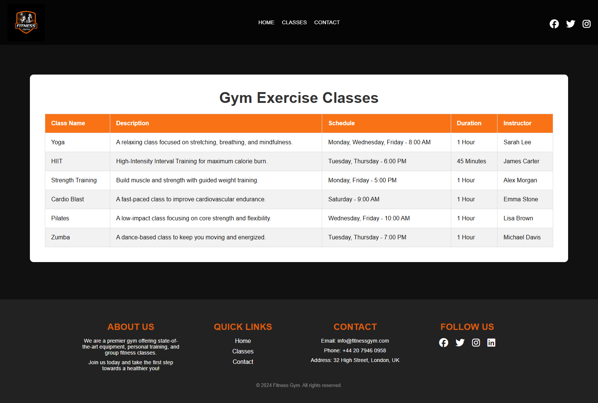
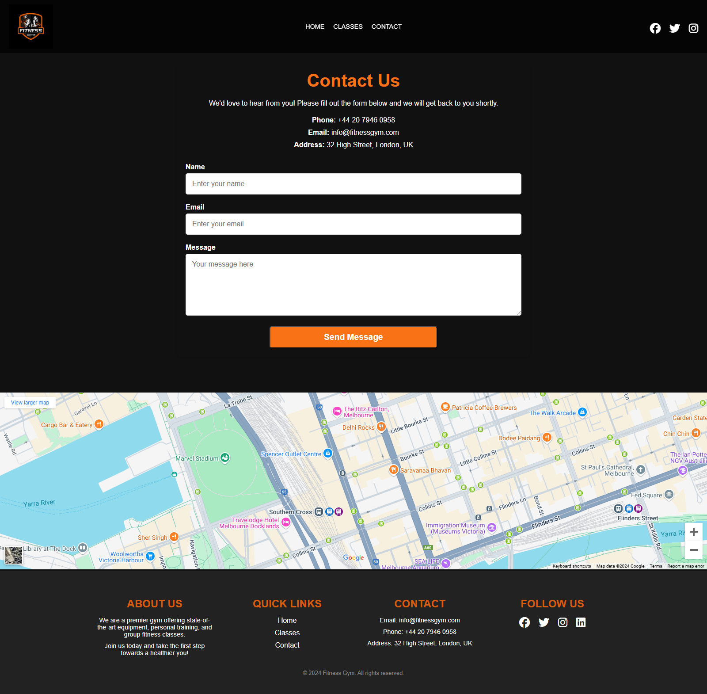

# Fitness Gym Web Application


## Overview

The **Fitness Gym Web Application** is a responsive, front-end website designed for fitness centers to promote their services. Users can explore classes, view membership options, and contact the gym through an interactive and user-friendly interface.

---

## Purpose

This application is intended to:

- Showcase gym services, schedules, and facilities.
- Provide transparent membership plan options.
- Simplify communication between potential members and the gym staff.

---

## Technologies Used

| Technology     | Purpose                            |
|----------------|-------------------------------------|
| HTML5          | Web structure                       |
| CSS3           | Styling and layout                  |
| JavaScript     | Interactivity (form validation, nav)|
| Google Maps API| Embedding gym location              |
| Font Awesome   | Icons                               |
| GitHub Pages   | Hosting the website                 |

---

## Key Features

### 1. Home Page:

- Highlights the gym's vision and facilities.
- Features a dynamic banner showcasing key offerings.

### 2. Classes Page:

- Displays a detailed table of available fitness classes, including their description, schedule, duration, and instructors.

### 3. Contact Page:

- Allows users to send inquiries through a form.
- Provides essential contact details and a Google Maps integration for location.

### 4. Responsive Design:

- Fully optimized for various devices including desktops, tablets, and mobile phones.

---


## 👥 User Stories & Testing

| User Story | Acceptance Criteria | Test Performed | Status |
|------------|---------------------|----------------|--------|
| As a user, I want to view available classes | Class list is viewable and understandable | Clicked "Classes" nav, confirmed content layout and descriptions | ✅ Passed |
| As a prospective member, I want to view membership plans | Pricing or plan info is accessible and readable | Scrolled homepage membership section, verified clarity | ✅ Passed |
| As a visitor, I want to contact the gym easily | Form is functional and validation blocks empty fields | Tested blank/valid submissions, confirmed alerts | ✅ Passed |

---

## Design Overview

### Colors Used

I chose a dark theme with orange accents to create an energetic fitness atmosphere:

- **Main Background**: Dark black (`#111`) for a modern look
- **Orange Accent**: Bright orange (`#f97316`) for buttons and highlights
- **Text**: White text on dark backgrounds for easy reading
- **Cards**: Dark gray (`#222`) for content sections

### Font Choice

- **Arial**: Clean and easy to read font for all text
- **Different Sizes**: Larger text for headings, smaller for navigation

### Layout Design

- **Responsive**: Website works on desktop, tablet, and mobile phones
- **Simple Navigation**: Fixed header that stays at the top
- **Cards**: Rounded corners and hover effects for interactive elements
- **Sections**: Alternating dark and light backgrounds to separate content

### Why This Design?

- **Orange Color**: Represents energy and motivation - perfect for a gym
- **Dark Theme**: Looks modern and professional
- **Simple Layout**: Easy to navigate and find information
- **Mobile Friendly**: Works well on all devices

---

## 📱 Manual Testing

| Functionality         | Test Description                              | Result      | Notes |
|-----------------------|-----------------------------------------------|-------------|-------|
| Navigation Links      | All links navigate to correct sections        | ✅ Pass     | Passed |
| Contact Form          | Inputs accept text but no real validation or submission | ⚠️ Partially Working | Form doesn't submit anywhere (no action) |
| Layout Responsiveness | Adjusted screen sizes and tested on mobile    | ✅ Pass     | Passed |
| Mobile Menu Toggle    | Opens on click, but doesn't auto-close on link click | ⚠️ Issue Noted |The menu opens on mobile view, but clicking a nav item doesn’t auto-close the menu. |

---

## 🌐 Browser Compatibility

Tested on latest versions of:

- Chrome ✅
- Firefox ✅
- Safari ✅
- Edge ✅

---

## 🚀 Performance Testing (Lighthouse)

| Category       | Score |
|----------------|-------|
| Performance    | 100%  |
| Accessibility  | 84%   |
| Best Practices | 100%  |
| SEO            | 91%   |

---

## 🔄 Development Lifecycle

| Phase        | Description                                               |
|--------------|-----------------------------------------------------------|
| **Planning** | Created user stories, mockups, and defined core pages     |
| **Design**   | Applied responsive UI/UX design with Flexbox & media queries |
| **Development** | Built layout, interactivity, and validation logic      |
| **Testing**  | Ran browser and device checks          |
| **Deployment** | Deployed on GitHub Pages                                |
| **Review**   | Fixed bugs, updated README and added documentation        |

---

## Deployment Procedure

To deploy this web application, follow these steps:

### 1. Clone the Repository:

```bash
git clone https://github.com/Lloyd952/Fitness-Gym.git
```

### 2. Navigate to the Project Directory:

```bash
cd Fitness-Gym
open index.html
```

### 3. Open the Project Locally:

- Use a local server (e.g., VS Code Live Server, XAMPP) to serve the HTML files.

### 4. Deploy on a Hosting Platform:

- **GitHub Pages:**
  1.  Push your project to a GitHub repository.
  2.  Go to **Settings > Pages**.
  3.  Select the branch where the project is stored.
  4.  Click "Save" and the site will be live.

## Screenshots

### Home Page


### Classes Page



### Contact Page



## Credits

- Developer: .[Lloyd](https://github.com/Lloyd952)
- Icons: [FontAwesome](https://fontawesome.com/)
- Map Integration: [Google Maps Embed API](https://developers.google.com/maps/documentation/embed/get-started)

## License

This project is open-source and available under the [MIT License.](https://choosealicense.com/licenses/mit/)
